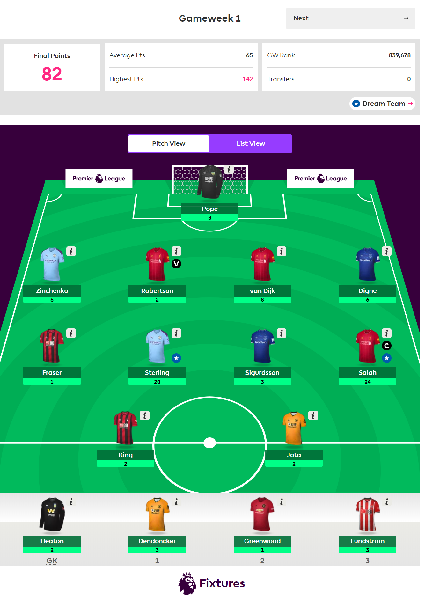
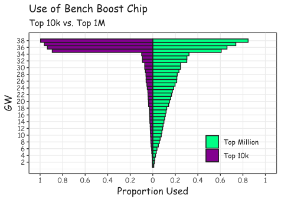
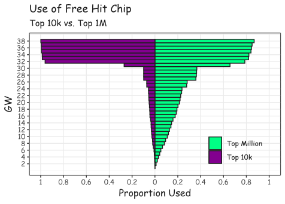
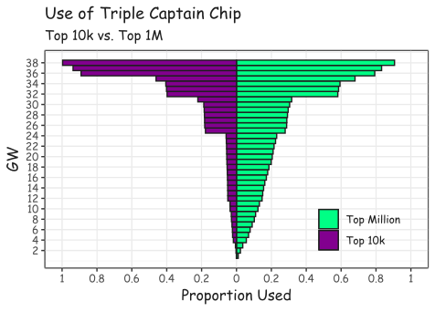

The Premier League is back. The season kicked off in August with last season's runners-up Liverpool giving newly promoted Norwich City a tough introductory lesson in the form of a 4-1 defeat. The Reds' talisman Mo Salah scored their second goal, before assisting Virgil van Dijk for their third. While this performance no doubt thrilled Liverpool fans, there was also another group of people who were just as (if not more) delighted with the display. That's the 44.7% of Fantasy Premier League managers who had Salah in their team.

For the uninitiated, Fantasy Premier League (commonly referred to as Fantasy Football) is an online game where six million users are provided with a virtual £100 million budget to assemble a squad of 15 real-life Premier League footballers from the 20 teams in the league. Each player has two characteristics: (a) their position - goalkeeper (GK), defender (DEF), midfielder (MID), or forward (FWD), and (b) the price one must pay to have them in their team.

The user must select two GKs, five DEFs, five MIDs and three FWDs while remaining on budget. Once the squad is ready, the user then proceeds to choose their 11 starting players, each of whom will score points as a result of their statistical performance in the physical matches they appear in with their team that Gameweek (GW). Users also nominate one of their players to be the team’s captain, which means that their point total is doubled that week. 

At the end of the GW, each team’s points are tallied and users are given a ranking, process which repeats throughout the season. The challenge of the game is to determine an optimal way of spending your budget as to maximise your points.

*How my team looked over the first GW of this season, giving me a total of 82 points and a measly rank of 839,678* 

During the off-season, researchers at [MACSI](https://ulsites.ul.ie/macsi/) in the University of Limerick undertook a large data scraping exercise to obtain the information of the top one million ranked players and their teams over the course of last season. We did so in the hope of gaining some insight into what characteristics and actions make a successful Fantasy Premier League "manager". Specifically, we want to look at the different actions taken by those users that finished in the top 10K positions, in comparison to the moves made by the rest of the top million users.

Let's focus on one element of the game, namely the manager’s use of chips. No, I’m not referring to their diet, but rather the three special Gameweek chips in the game itself. These allow users to have special privileges during the week that chip is played.

Due to the hectic nature of the English football season, there are occasions when fixtures must be rearranged known in Fantasy Football as Blank Gameweeks and Double Gameweeks.

**Blank Gameweeks** are GWs in which there are less than the usual ten fixtures as a result of fixture postponement. This occurred in 2017/18 in GW 27, 31 and 33 where there was only eight, five and six fixtures respectively. These weeks can make it difficult for users to field a full team of 11 playing players.

**Double Gameweeks** occur when teams who have fixtures postponed must play two matches in a GW. These offer prime opportunities to make extra points as players now have twice the opportunity to earn more points. Last season, these occurred in GW 32, 34 and 35, when there were a whopping 15, 11 and 14 games played.

The most successful chip strategy from last season was the **Bench Boost**. You choose a team of 11 starting players from your squad of 15 players and the remaining four are what are known as bench players. The point scores of these bench players don’t contribute to your GW total aside from the week in which one plays their bench boost chip. It would appear that if one’s bench players were going to receive points then the ideal time to use this chip would be when each of these players may play twice (to maximize the potential upswing from the chip) i.e., during one of the double GWs. Our analysis as seen in the following graph supports this claim:

*How my team looked over the first GW of this season, giving me a total of 82 points and a measly rank of 839,678* 

You can see how a massive 79% of the players in the top 10k used the bench boost chip in GW 35 (the week of the season where there were the most fixtures). This compared to only 29% of those in the top 1 million. In fact, less than 10% of top 10k users had used the chip prior to this GW, a figure which the top 1 million surpassed by GW 14! The result? The top 10k users were much more likely to have obtained a higher point total from this chip (23.16) than the remaining players in the top 1 million (13.82).

In Fantasy Football, users can make only one free transfer in any GW, which allows them to exchange one of their players for another player in the game (provided they can afford them). The **Free Hit** chip allows the user to make unlimited transfers for that week. They could choose a new squad of 15 if they so pleased, but their team then reverts to how it was at the start of the week.

There tends to be two schools of thought within the Fantasy Football community as to what is the best way to use this chip. Should one use it during a blank GW when a large number of their players might not have a game? Or target the double GWs, because they have the chance of essentially hand-picking players appearing in 22 games (if their 11 starters all have two matches)? 

*How my team looked over the first GW of this season, giving me a total of 82 points and a measly rank of 839,678* 

Our analysis (above) looked into what was the best strategy last season. 33% of users in the top 1 million had used this chip prior to GW 27 i.e. before any of the blank/double GWs came into play, which pales with the 7% of top 10k. We found that a massive 33% of the top million used it in GW 31, the week with the fewest fixtures, in comparison with 17% of the top 10k.

The other considerable GW which featured the chips use was GW 32, the large double Gameweek, with 69% of those who finished in the top 10k choosing to use the chip then, compared with only 15% of the remaining users. The top 10k generally received more points from this chip with a mean points value of 84.7, compared to 60.5 for the top million users. This suggests the strategy of using the chip during a large double GW was most definitely the best approach to take last season.

Each Gameweek, the user nominates one of their players to be the team's captain, which means that their point total is doubled that week. The **Triple Captain** chip simply increases this to a factor of three. This is arguably the chip which offers the most uncertain returns, because not only does one have the option of which GW to use the chip but also the choice of player to give the virtual armband to.

The temptation to use this chip during a double GW (eg Sergio Aguero for Manchester City versus Fulham and Cardiff City in GW 32) is obviously very enticing since the player would have two games from which they could return triple gains. However, if their team has two difficult fixtures it may not prove to be worthwhile, and one may instead prefer to use it during a normal single GW where the player has an appealing fixture (e.g., Salah for Liverpool versus Huddersfield Town in GW 36). A third option that is commonly mentioned is to use the chip in the final GW where many teams have nothing to play for and can result in high score-lines (e.g., Nathan Redmond for Southampton vs. Huddersfield in GW 38).

*How my team looked over the first GW of this season, giving me a total of 82 points and a measly rank of 839,678* 

Investigating the data found a variety of strategies for this chip at different points in the season. Once again, we highlight the fact that while only 6% of top 10k users had used their triple captain chip by GW24, a considerable 25% of the remaining players had done so at the same point. In terms of the GW in which it was most commonly used, we found that 43% of top 10k users used it in GW 36, which interestingly was a single GW (where Liverpool had a very attractive game in terms of difficulty). 29% of the top 1 million decided that the double GW 32 was the optimal time to play the chip.  

In terms of the range of scores obtained, it appears that the triple captain chip offers the least in terms of total number of points, which in some way is to be expected as it only provides an increase for a single player. We found that the triple captain chip resulted in a mean score of 11.5 for the top 10k and 8.67 for the other group.

For Fantasy Football managers looking for tips regarding the optimal way to use their chips, here are some suggestions from the data

- Save your chips! While it is very tempting to use a chip at an early stage in the season to get the top spot in your league, we can see from last season's data that good users saved their chips until the last 10 weeks in the season to make the most of the blank and double GWs.

- There are generally two large double GWs and these are prime times to use your chips to maximise your returns, especially the Bench Boost. Almost 80% of top 10k managers used this strategy.

- Don’t be afraid to play your Triple Captain chip in a single GW. It is very tempting to use the chip during a double GW, where the player has two opportunities to score points. But if the fixtures aren’t great for the player, it is arguably better to use it in a single GW where they have a nice fixture as shown by the top 10k using the chip in GW 36 when Liverpool played Huddersfield.

This project is still very much a work in progress and any comments or suggestions of potential research avenues will be greatly appreciated. We hope that all the managers considering their options throughout this season have found some useful information to help them climb up the leader board with our analysis of the different chips. It's worth noting that while these strategies performed well during last season for the top 10k, this is not to say the same will happen this season. Of course, you’re free to trust them blindly, which may result in an improvement of your own overall rank.

*This article originally appeared on RTE Brainstorm, the article can be found [here](https://www.rte.ie/brainstorm/2019/0911/1075310-the-maths-of-fantasy-football/).*
