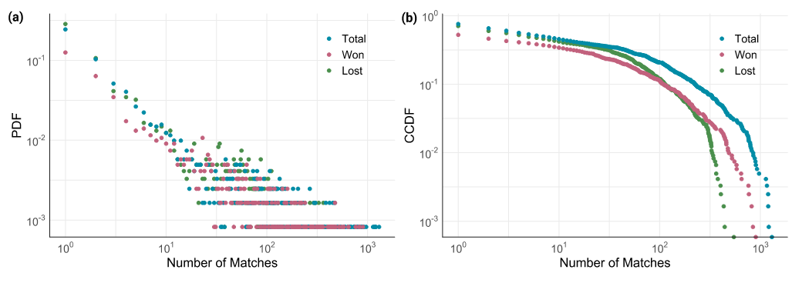
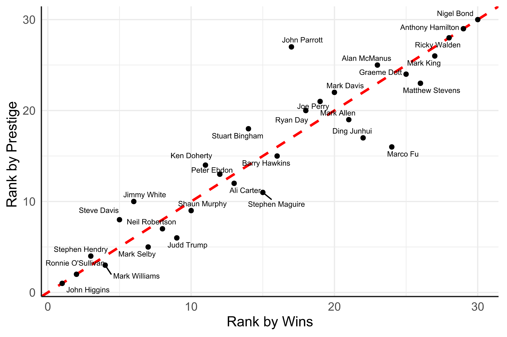

One does not have to look far to observe the innate desire us humans have to rank things. Each year we are faced with endless awards ceremonies—just think about the Oscars, Grammys, Ballon d’Or, Time Person of the Year… the list goes on and on. Indeed, at the turn of every year/decade/century media organizations fill whitespace with their “top 100 (insert domain of interest here) of (insert temporal period here)” where a supposed expert gives their thoughts on the optimal ordering of entities from the domain of choice. These rankings are, however, far from definitive, and rather than settle an argument they instead tend to simply add fuel to the fire of the debate. The main problem with these approaches is that the rankings tend to be based upon personal preference with an extremely high level of subjectivity (the player who scored the goal that won their team the cup, the movie they saw on their first date…). In an ideal science-based world, however, any ranking would be determined using an entirely objective approach which, unfortunately, requires detailed data describing the interactions between different entities to determine who/what exactly is the best.  
While the collection of such data can prove difficult for most domains, one area in which there is no shortage of detailed historical data of competition is within the field of sport. Rather, there is in fact a data revolution taking place in sport whereby athletes are becoming increasingly aware of statistics and, moreover, devoted fans of said sports have amassed huge collections of historical results that readily allow for data-driven mathematical analysis to be conducted. Motivated by this, researchers at MACSI (Mathematics Applications Consortium for Science and Industry) based in the University of Limerick in Ireland posed the following problem—who is the greatest snooker player of all time? 
For the unaware, snooker is a cue-based game in which competitors compete head-to-head by trying to strike balls on a rectangular table and obtain points, based upon the denomination of the ball, as a result of successfully landing it within one of the six “pockets” or holes on the table. Like most sports, there is constant discussion regarding which competitor is the greatest to have graced the game. 
To answer the question in a quantitative manner the first thing needed was detailed data of results from the sport which were obtained via a large data scraping exercise (involving pulling statistics from multiple webpages). This resulted in a collection of the match results from over fifty years (1968-2020), amounting to 657 tournaments featuring 1,221 unique players competing in 47,710 matches.
With this data at hand, the question then becomes how best to use it in ranking the competitors. Perhaps the most obvious thing to do would be simply to count the number of times each player had won, the equivalent of giving the Oscar to the highest grossing movie—not ideal. The issue with this approach is in the fact that the player with the most wins could simply repeatedly play Joe Bloggs at the snooker hall. In order to offer an alternative approach, we make use of the network description of this data. This network is obtained by letting each player be represented by a node and for each match an edge is drawn from the losing node to the corresponding winning node. 

*(a) Probability distribution of the number of matches (blue), wins (pink), and losses (green) for each professional Snooker player. Each point shows the fraction of players that had a certain number of each quantity. Note the scale of both axes are logarithmic suggesting that most players appear in very few matches while a select few appear much more often. (b) Corresponding plot but now showing the probability of having more than a certain number of matches for each player.* 

Figure 1 shows the corresponding probability distributions describing the number of matches, wins, and losses for each player, which appears to be highly skewed, suggesting a form of “Matthew effect” occurring in the sport in that a select few players win many games while many players win very few. Using this networked representation, an algorithm was proposed which could be used in identifying a ranking of the most important players. In particular, this algorithm considers not only how many times one player defeated another but also how frequently the defeated player themselves defeated others. In this sense each player has some associated prestige describing their quality, and in defeating a player the winner receives some of this associated prestige. This implies that a win against a strong competitor with high prestige is now more worthwhile to a player’s rank than defeating a weaker competitor. 

Using the approach described above, after constructing a network based upon all recorded professional snooker games, it can quickly be determined who is the greatest player of all time. Interestingly, it is not Ronnie O’Sullivan with his natural talent, Steve Davis and his distinguished trophy room, or the winning machine known as Stephen Hendry, but rather the four-time world champion John Higgins! This result may seem surprising to some snooker fans but when the data is considered it is entirely understandable. While both Davis and Hendry have plenty of trophies and wins to their name, the quality of player competing in their era was considerably less than those faced by Higgins and O’Sullivan (who is ranked the second greatest through our approach).  

*Rankings of the top 30 Snooker players of all time based upon the level of prestige determined via the proposed algorithm (vertical axis) compared to their ranking based upon total wins (horizontal axis). The red line acts as a reference for those players who were ranked higher by prestige than wins (under the line) and vice-versa (above the line).* 

Moreover, this approach can give an indication as to which players have faced tougher competition in wins during their careers. This is highlighted in Figure 2 where the top 30 players ranked using the prestige approach (our algorithm) is compared to their ranking based upon the number of wins. While the two ranking schemes are clearly very correlated, a considerable amount of information may be obtained from the location of players within this graphic. Those players who are above the red line (Davis, Hendry, White…) have obtained their wins from less competitive games (i.e., their wins were accumulated against players with less prestige), while the contrary is true for those below the line, many of whom are from the modern era.
In order to help satisfy the intrinsic human desire to rank entities, this work has proposed a method which utilizes a mathematical framework to determine a ranking of competitors which considers not only the number of times a player has won but also the quality associated with each win. Excitingly, this concept offers plenty of room for extension to any domain for which detailed data on interactions is available and can hopefully help in ending the many arguments about the greatest competitor in your favourite area of interest!

*This article originally appeared on Oxford University Press Blog, the article can be found [here](https://blog.oup.com/2021/05/a-complex-networks-approach-to-ranking-professional-snooker-players/).*
